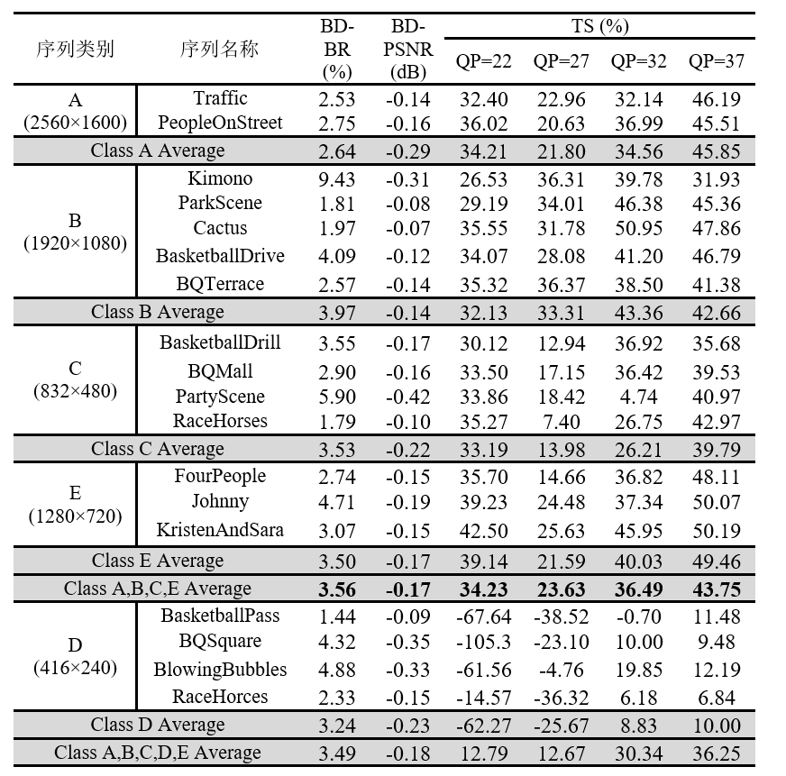
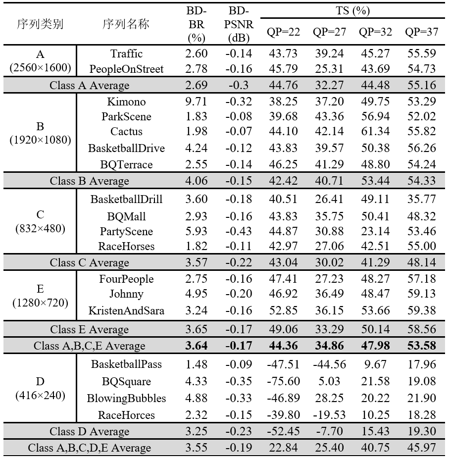

## 描述

我们在x265编码器中实现了基于离线模型推理的编码块划分集成方案，本项目提供了该方案的Inference部分，即具备编码块划分加速的x265编码器、解码器和调用脚本。

实验表明，在HEVC标准测试序列上，集成块划分加速算法后的x265编码器相比于原始x265编码器在medium配置和veryslow配置下分别降低了34.53%和55.21%的编码时间，同时仅增加了3.56%和3.66%的BD-BR。此外，相较于原始速度更快的medium配置，集成了加速算法后的x265编码器在veryslow配置下编码复杂度平均降低了29.52%，同时BD-BR降低了2.26%，这证明了本文所提出的快速编码块划分方法的有效性。

medium配置下的x265(Origin版本)加速后的BD-rate变化如下图所示



medium配置下的x265(Anchor版本)加速后的BD-rate变化如下图所示



如上所示，在medium配置下，集成快速编码块划分算法的原始x265和完备x265在A、B、C和E类上分别平均取得了34.53%和45.20%的编码复杂度降低，同时仅伴随着3.56%和3.64%的BD-BR增加以及-0.17dB的BD-PSNR降低。值得注意的是，因为在最新编码标准VVC的通测条件中D类序列不再计入平均计算，所以D类序列的测试结果仅列出以供参考。

一个更加有说服力的优势是，**集成编码块划分加速后的x265 veryslow在重建质量上较未加速的x265 medium更好，在长序列上取得了平均2.26%的BD-BR下降和0.11dB的BD-PSNR提升**，具体数据如下所示


## 测试命令

需要说明的是，x265不同于HM，相当一部分的命令必须使用命令行传入而不能用cfg配置文件传入，为了让控制方式更加统一，所有的命令都是通过命令行的方式传入的。因此，每个YUV序列的名称需要被精心设计，命名格式如下
`SeqName_WidthxHeight_FrameNum_FrameRate_bitdepth.yuv`，例如`BasketballPass_416x240_500_50_8`。

用户需要在`./Test_Sequence_List.txt`中指定需要编码的YUV序列，序列名称需满足以上要求。`./HEVC_Test_Sequence.txt`提供了HEVC CTC 所涉及的序列名称。

检查`./Test_Sequence_List.txt`中的视频序列保存在`./sequences`之后，cd到项目目录路径下，输入以下命令
```
python dp_total_test.py --qp 22 --batchSize 200 --encoder_type origin
```
即可自动编解码，编码得到的码流存放在`./output`中，解码得到的重建序列在`./rebuild`中。

**说明**

(1) x265编码器分为origin和anchor两类，后者相比前者增加了针对CTU是否划分的判断，但是因为该判断在Y域对编解码性能的提升十分有限，所以更加建议使用origin

(2) 增加`--save_depth_flag`的命令，可以保存划分深度文件（保存在`./DepthFlag`中），但是一般出于减少内存消耗的考量，划分深度文件会作为中间文件阅后即焚

## 其他文件

(1) `./dataset.py`搭配`./codec/Release`下的编码器，用于制作基于DIV2K的块划分数据集

(2) `./dp_total_train.py`，训练代码

(3) `./log2xls.py`，读取encoder的日志文件，写入计算BD-Rate的Excel脚本。但是保存时excel脚本会丢失宏，所以需要手动将数据再复制到没有丢失宏的excel脚本，该问题目前还没有较好的解决方案。

## 其他问题

程序会识别YUV比特深度，如果是10bit，会调用`./codec/x265/anchor_dpfast_x265_encoder_10bit.exe`或者`./codec/x265/origin_dpfast_x265_encoder_10bit.exe`，因为x265编码高比特深度的YUV序列时会存在某些限制，导致编码可能不成功，一个已经确定的限制是 编码10bit序列时，系统必须为64位。

更多关于x265 10bit的配置和讨论，可以参考文章 https://mp.weixin.qq.com/s/BmLCGH3F8LDhrPO7Zz9SLw

## 致谢

测试框架由FengAolin (USTC,EECS Master 2019)提供。

## 联系

Feng Xinmin, xmfeng2000@mail.ustc.edu.cn
