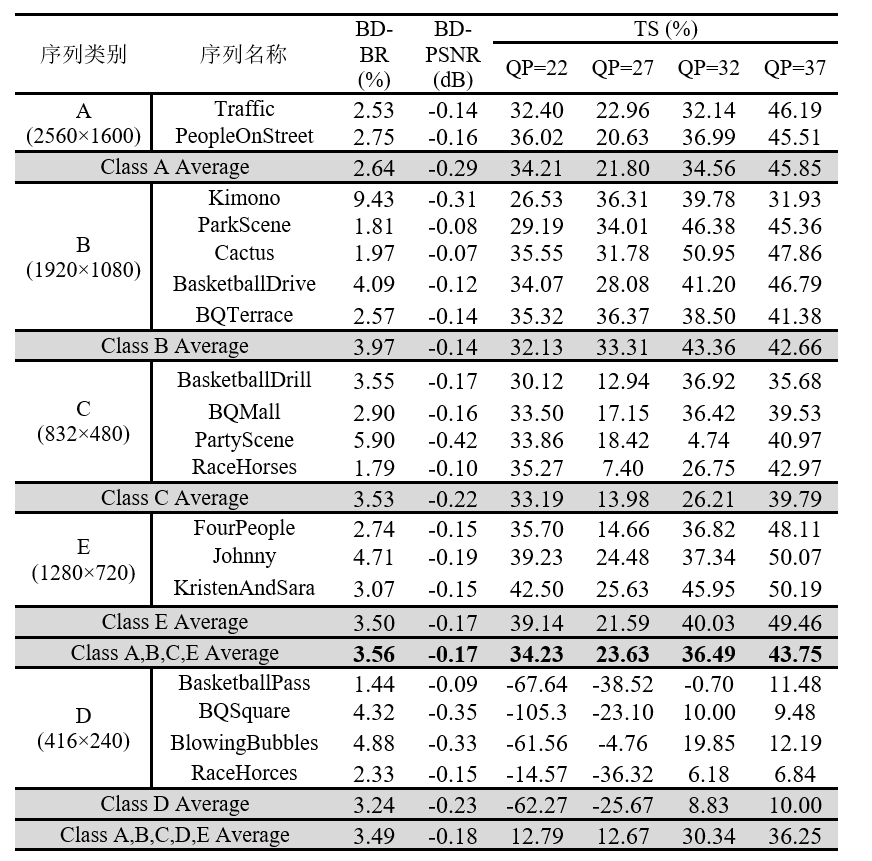
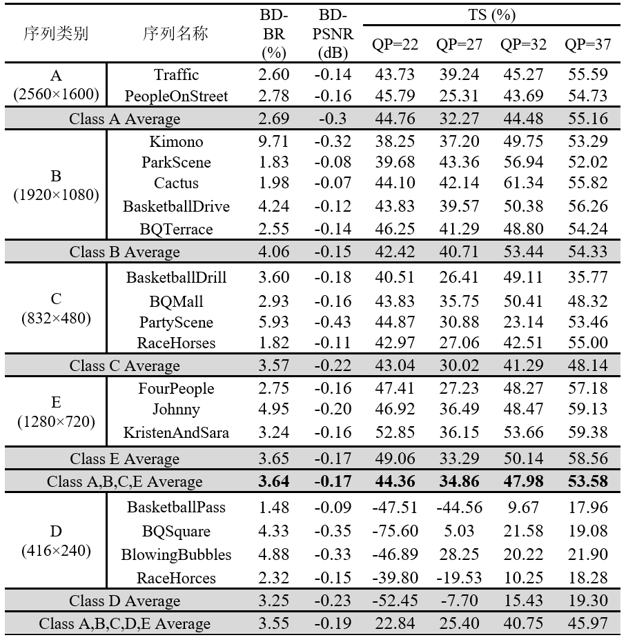
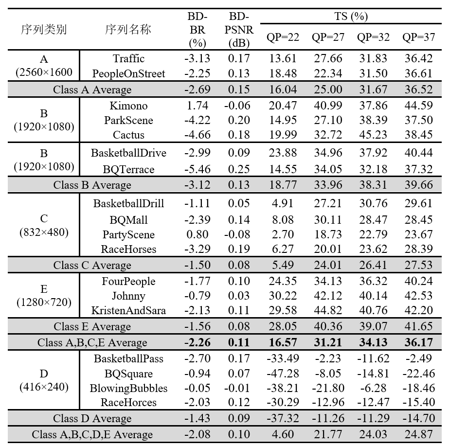

## Distribution
IDepthmap-x265 provides an integrated scheme of Fast coding block partitioning based on offline model Inference in the x265 encoder. The Inference part of the scheme is provided in this project, including x265 encoder with coding block partitioning acceleration, decoder and python script.

The experimental results show that, **compared with the original x265 encoder, the x265 encoder with the integrated block partition acceleration algorithm reduces the coding time by 34.53% and 55.21% respectively in medium and veryslow configurations, and only increases BD-BR by 3.56% and 3.66% respectively.** 

In addition, compared with the original medium configuration, iDepthMap-x265 is faster, the coding complexity of x265 encoder integrated with the acceleration algorithm is reduced by 29.52% on average in veryslow configuration, while BD-BR is reduced by 2.26%, which proves the effectiveness of the fast coding block partitioning method proposed in this repo.

The BD-rate of x265 (Origin version) accelerated in Medium configuration is shown in the following figure



The BD-rate of x265 (Anchor version) accelerated in Medium configuration is shown in the following figure




As shown above, under Medium configuration, original x265 and Anchor x265, which integrated fast coding block partitioning algorithm, achieved an average reduction of 34.53% and 45.20% in class A, B, C and E, respectively. At the same time, BD-BR increased by 3.56% and 3.64%, and BD-PSNR decreased by -0.17dB. It is important to note that the test results for class D sequences are listed only for reference, because class D sequences are no longer included in the average calculation in the general test conditions of the latest coding standard VVC.

A more convincing advantage is that **x265-veryslow with integrated coding block partitioning acceleration is better than unaccelerated x265-medium in terms of reconstruction quality, achieving an average 2.26% BD-BR decrease and 0.11dB BD-PSNR increase on long sequences**, as shown below




## Test Commands

It should be noted that x265 is different from HM in that manny of commands must be passed through the command line rather than the configuration file. To make the control mode more uniform, all commands are passed through the command line. Therefore, the name of each YUV sequence needs to be carefully designed in the following format.

`SeqName_WidthxHeight_FrameNum_FrameRate_bitdepth.yuv`

for example, `BasketballPass_416x240_500_50_8`.

The user needs to specify the YUV sequence to be encoded in the `./Test_Sequence_List.txt` firstly. The sequence name must meet the above requirements. Moreover, `./HEVC_Test_Sequence.txt` provides the sequence names involved in the HEVC CTC.

Check that the sequences in `./Test_Sequence_List.txt` is saved in `./sequences/`, then *cd* to the project directory, and run the following command

```
python dp_total_test.py --qp 22 --batchSize 200 --encoder_type origin
```

Then, the encoded bit-stream is stored in `./output`, and the decoded reconstructed sequence is in `./rebuild`.


**Supplementary Instruction**

(1) x265 encoders are divided into two categories in this repo: Origin and Anchor. Compared with the Origin, the Anchor adds judgment on whether CTU is divided. However, since the improvement of codecs performance in Y domain by this judgment is very limited in our experiments, the Origin is more recommended in practice.

(2) You can add the '--save_depth_flag' command to save the partition depth file (save in `./DepthFlag`). But generally for the sake of reducing memory consumption, the partition depth file will be burned as an intermediate file after using.


## Other Files

(1) `./dataset.py` could be used to make a block partition dataset based on DIV2K

(2) `./dp_total_train.py` is used to train the model

(3) `./log2xls.py` is used to read Encoder's log file and write Excel script to calculate BD-rate in the HEVC CTC. However, the Excel script will lose macros when saving, so you need to manually copy the data to the Excel script that does not lose macros. As far as now, there is no good solution to this problem.


## Other Problems

The program will recognize bit-depth of encoded YUV sequence, if it's 10 bits, `./codec/x265/anchor_dpfast_x265_encoder_10bit.exe` or `./codec/x265/origin_dpfast_x265_encoder_10bit.exe` will be called, because x265 encodes YUV sequences at high bit depths with certain limitations, therefore the encoding may not be successful. One established limitation is that the system must be 64 bits when encoding 10bit sequences.

More configuration and discuss about x265 10 bit, you can refer to https://mp.weixin.qq.com/s/BmLCGH3F8LDhrPO7Zz9SLw

## Acknowledge

The testing framework of iDepthmap-x265 is developed based on FengAolin's framework. 

## Connact

Feng Xinmin, xmfeng2000@mail.ustc.edu.cn
